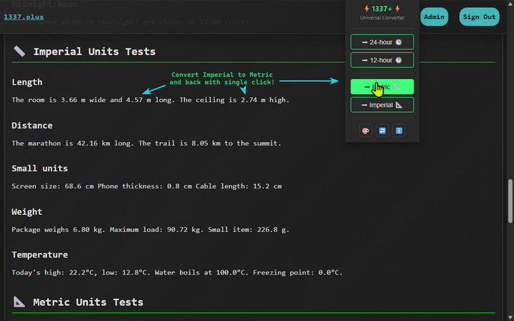
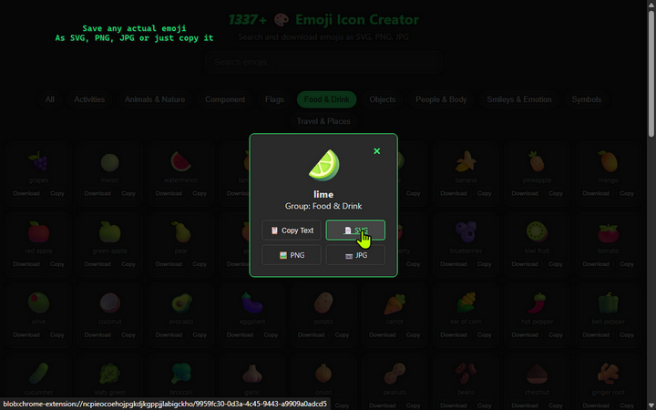

# 1337+Helper - Universal Converter Extension

A lightweight Chrome/Edge browser extension that provides instant conversions and utilities right from your browser.

## 📸 Screenshots

  
  

## 🚀 Features

### ⏰ Time Format Converter
- **12-hour → 24-hour**: Converts AM/PM times to 24-hour format
- **24-hour → 12-hour**: Converts military time to AM/PM format
- Supports various formats: `6AM`, `6:30 PM`, `6:30PM`, etc.

### 📏 Unit Converter
- **Imperial → Metric**: inches→cm, feet→m, miles→km, pounds→kg, °F→°C
- **Metric → Imperial**: cm→inches, m→feet, km→miles, kg→pounds, °C→°F
- Works on any webpage with a single click

### 🎨 Emoji Icon Creator
- Browse 3500+ emojis organized by categories
- Search emojis by name
- Download as PNG, SVG, or JPG
- Copy emoji as text
- Perfect for creating icons for projects

## 📦 Installation

### From Source
1. Download or clone this repository
2. Open Chrome/Edge and go to `chrome://extensions/`
3. Enable "Developer mode"
4. Click "Load unpacked" and select the extension folder
5. The 1337+Helper icon will appear in your toolbar

### From Store (Coming Soon)
- Chrome Web Store: [Pending]
- Edge Add-ons: [Pending]

## 🎯 Usage

1. **Click the extension icon** to open the popup
2. **Choose your conversion**:
   - ➡ 24-hour 🕒 - Convert all times on the page to 24-hour format
   - ➡ 12-hour 🕐 - Convert all times on the page to 12-hour format (AM/PM)
   - ➡ Metric 📏 - Convert imperial units to metric on the page
   - ➡ Imperial 📐 - Convert metric units to imperial on the page
3. **Utility buttons**:
   - 🎨 - Open Emoji Icon Creator
   - ↩️ - Reset/refresh the current page
   - ℹ️ - About the extension

## 🛠️ Technical Details

- **Manifest V3** compatible
- **No external dependencies** - pure JavaScript
- **Minimal permissions** - only activeTab and scripting
- **Lightweight** - instant conversions without API calls
- **Cross-browser** - works on Chrome, Edge, and Chromium-based browsers

## 📝 License

Open source - feel free to modify and distribute

## 🔗 Links

- [Test Page, Privacy Policy, Description](https://1337.plus/record?id=bdb7660a-34c6-4390-9c18-68ef5494ece6)
- [Report Issues](https://github.com/diviatrix/1337-Helper-chrome-extension/issues)

---

Made with Anxiety ❤️ for productivity